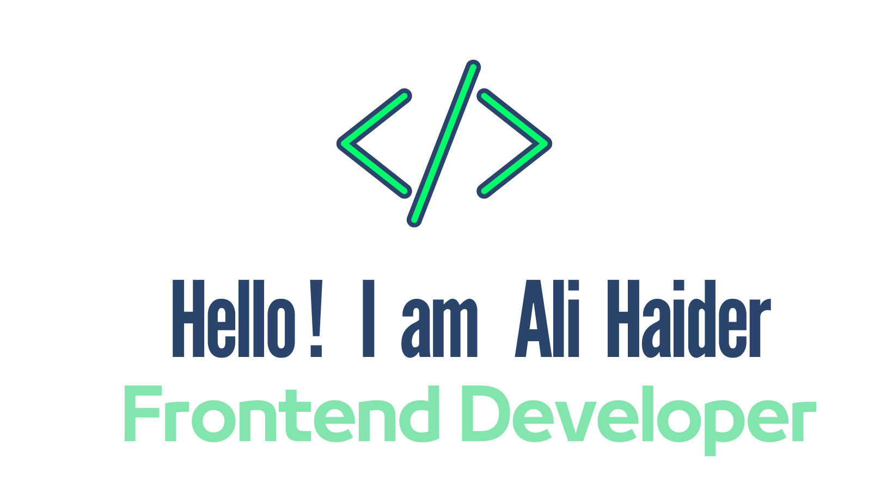
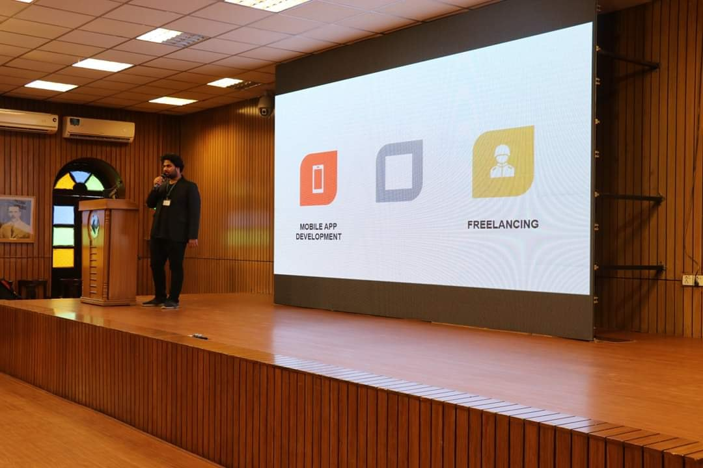
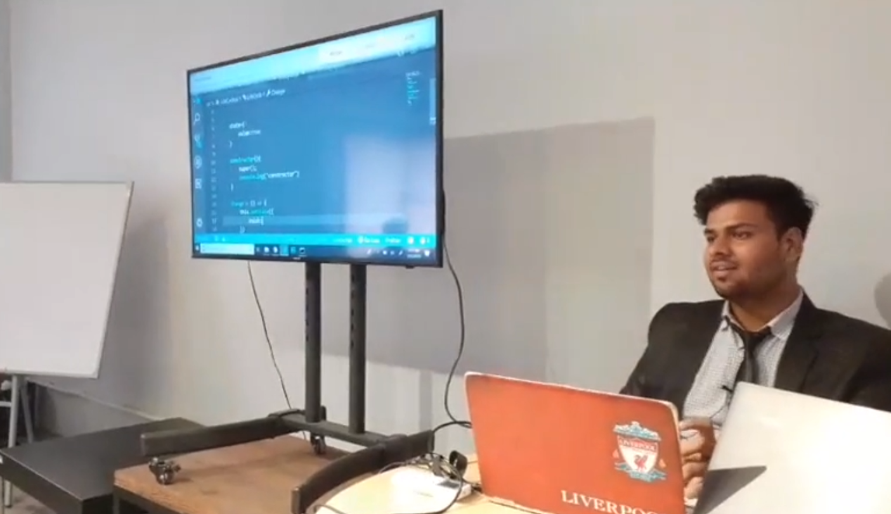
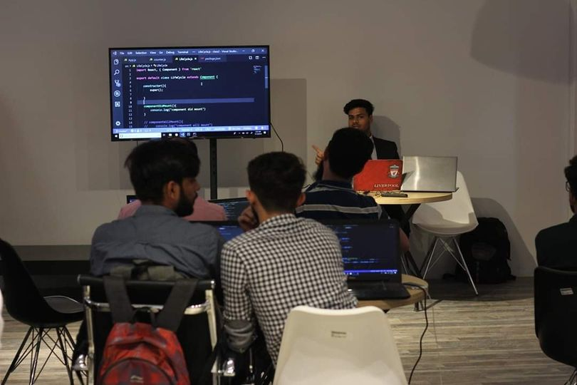
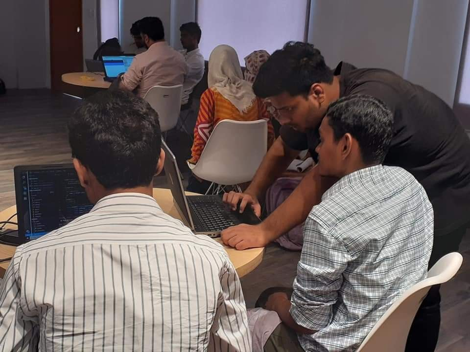
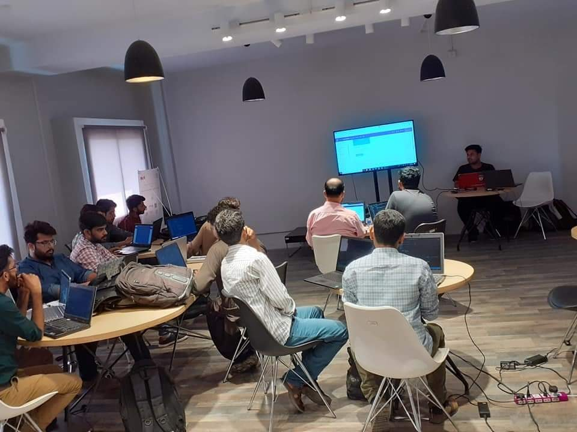

I'm a self-taught passionate Fullstack developer from <b>🇦🇺 Newcastle, Australia</b>. I have <b>5+ years</b> of experience in building Web and Mobile applications with <b>JavaScript / Typescript / ReactJS / NextJS / React Native / Nodejs / .NET Core</b> and some other cool libraries and frameworks. Currently doing my <b>Masters in Information Technology</b> from Kings Own Institute

## 🧑 About me

- 💼 Fullstack Engineer at [MAE Logistics Sydney](https://maelogistics.com.au/)

- 👨‍🏫 Trainer

- 💻 My Profile in [Linkedin](https://www.linkedin.com/in/ali-haider-25a08b125/)

- 📖 Master of Information Technology from [Kings Own Institute](https://koi.edu.au/)

- 💬 Reach out to me on my email [alimurtuza718@gmail.com](mailto:alimurtuza718@gmail.com)

## 🏢 Organizations I have worked With

- [MAE Logistics](https://maelogistics.com.au/)
- [RAENA](https://www.raenabeauty.com/)
- [Somee Social](https://somee.social/)
- [BizIntel](https://bizintel.co/)

## 🌐 Websites I have developed

- [MAE Portal](https://happy-pebble-073deb310.3.azurestaticapps.net/)
- [AYMS International](https://ayms.com.au/)
- [Somee Social](https://somee.social/)
- [Rdash 360](https://rdash360.com/)
- [Linkstore - testing version](https://stg.rdash360.com/linkstore)
- [Dresez](https://dresez.com/)

## 📱 Mobile applications I have developed

- [RAENA Reseller & Dropship App](https://play.google.com/store/apps/details?id=com.raenaapp&hl=en&gl=US)
- [Somee Social](https://play.google.com/store/apps/details?id=com.someesocial&hl=en&gl=US)
- [Beeplink](https://play.google.com/store/apps/details?id=com.beeplink.beep&hl=en&gl=US)
- [Bakier](https://play.google.com/store/apps/details?id=com.bakier.co&hl=en&gl=US)
- [Glow Calculator](https://play.google.com/store/apps/details?id=com.codebusterspro.glowcalculator&hl=en&gl=US)
- [Macca Motors](https://play.google.com/store/apps/details?id=macca.macca.bizintel&hl=en&gl=US)

## 🧰 Languages and Tools

 

## 📅 Hobbies

- Play videogames
- Travelling
- Cooking

## 💬 Where to find me

 

<!--  -->

<!-- 
  -->

## 👨‍🏫 I also give training

- Fullstack web development (React.js / Reactnative / .NET core)
- Javascript / Typescript / C#
- Git
- Progamming

## 😎 Training in style

## 🎵 Spotify status

