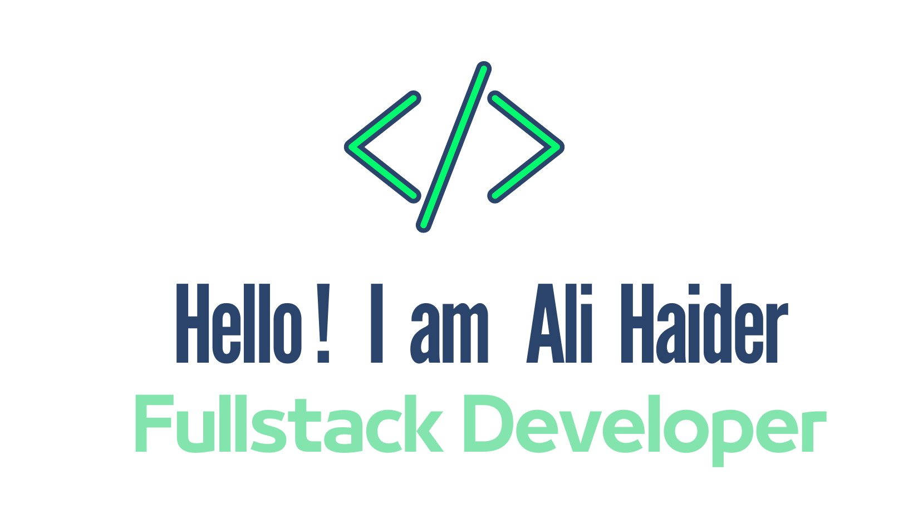

 

I'm a self-taught passionate FrontEnd developer from <b>Newcastle, Australia</b>. I have <b>3+ years</b> of experince in building Web and Mobile applications with <b>JavaScript / Typescript / ReactJS / NextJS / React Native</b> and some other cool libraries and frameworks. Currently doing my <b>Masters in Information Technology</b> from Kings Own Institute.

 

**About me**

- 💼 FrontEnd Engineer at [RAENA](https://www.raenabeauty.com/)

- 💻 My Profile in [Linkedin](https://www.linkedin.com/in/ali-haider-25a08b125/) 

- 📖 Master of Information Technology from [Kings Own Institute](https://koi.edu.au/) 

- 💬 Reach out to me on my email [alimurtuza718@gmail.com](mailto:alimurtuza718@gmail.com)

 

**Organizations I worked With**
- [RAENA](https://www.raenabeauty.com/)
- [Somee Social](https://somee.social/)
- [BizIntel](https://bizintel.co/)

 

**Websites I developed**
- [Somee Social](https://somee.social/)
- [Rdash 360](https://rdash360.com/)
- [Linkstore - testing version](https://stg.rdash360.com/linkstore)
- [Dresez](https://dresez.com/)

 

**Mobile applications I developed**
- [RAENA Reseller & Dropship App](https://play.google.com/store/apps/details?id=com.raenaapp&hl=en&gl=US)
- [Somee Social](https://play.google.com/store/apps/details?id=com.someesocial&hl=en&gl=US)
- [Beeplink](https://play.google.com/store/apps/details?id=com.beeplink.beep&hl=en&gl=US)
- [Bakier](https://play.google.com/store/apps/details?id=com.bakier.co&hl=en&gl=US)
- [Glow Calculator](https://play.google.com/store/apps/details?id=com.codebusterspro.glowcalculator&hl=en&gl=US)

 

**Languages and Tools**

 

 
             
 

 

 

## 📅 Hobbies
- Play videogames
- Travelling
- Cooking

 

## 👨‍🏫 I also Teach
- Frontend web development (React.js / Reactnative)
- Git
- Progamming

## 🖼️ Screenshots of me Teaching

